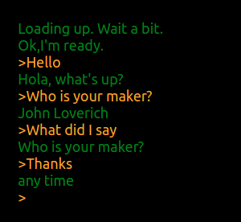

## Neural Chatbot React Retro

A react component for the [neural-chatbot](https://www.npmjs.com/package/neural-chatbot) that looks a little like a terminal.  The application is completely client side so it runs int the browser.

## Installation

```bash
npm install neural-chatbot-react-retro
```

## Details

The Neural Chatbot is a completely client side chat bot.  You can embed it in browser applications without the need for an API key and without sending any information to external servers.  It uses tensorflowjs universal sentence embeddings for intent classification followed by a similarity based slot filling system.  This bot relies on the following npm modules which can be used in other natural language understanding systems [neural-chatbot](https://www.npmjs.com/package/neural-chatbot), [neural-phrasex](https://www.npmjs.com/package/neural-phrasex), [neural-sentence-search](https://www.npmjs.com/package/neural-sentence-search), [slot-filler](https://www.npmjs.com/package/slot-filler), [sentence-similarity](https://www.npmjs.com/package/sentence-similarity) and of course tensorflowjs.



The component has several properties including the "botConfig" which contains the phrase database.  See [here](https://github.com/jloveric/neural-chatbot-react-retro/blob/master/src/Chatbot.js) for an example. A running (work in progress) example is provided [here](https://jloveric.github.io/)

Here are the default properties for the component

```javascript
static defaultProps = {
    backgroundColor: 'black',
    botColor: 'green',
    userColor: 'orange',
    botSymbol: '',
    userSymbol: '>',
    startMessage: "Loading up.  Wait a bit.",
    finishedLoadingMessage: "Ok,I'm ready.",
    fontSize: "large",
    botConfig: defaultConfig
  }
```
and this is how the component can be called
```javascript
import React from 'react';
import NeuralChatbotReactRetro from 'neural-chatbot-react-retro'

function App() {
  return (
    <div style={{ margin: '2%' }}>
      <NeuralChatbotReactRetro backgroundColor='black'></NeuralChatbotReactRetro>
    </div>
  );
}

export default App;
```